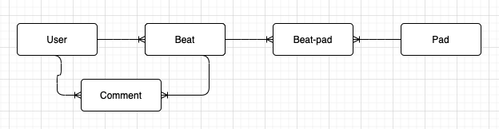

# Beat Machine - Frontend

## Introduction
This app is a drum sequencer. It has 10 channels. Each will play its own sample with a different sequence. Each sample also has its own volume, pitch and panning. The sequencer is set at 4/4 time subdivided into 16th notes. The user can also change the tempo on their beat.

Once a beat is created, a logged in user can save the beat. A logged in user can also view their profile where they can see a short bio and a list of all their saved beats. A logged in user can also view other user's profiles and view/listen to other user's beats. A logged in user can also comment on saved beats.

This project was created as my capstone project for Flatiron school. I decided to make this app because I have experience in working with audio and wanted to see if I could figure out how to play back audio in time to create something musical. 

It was fun and challenging learning to use the Web Audio API for this purpose. I also used the project to learn a little about Firebase Storage to store my audio samples. Firebase also allowed me to add the ability for users to upload their own samples to play with.

## Technologies
Project is created with:
- React 17.0.2
- Redux 4.1.0
- React-Redux 7.2.4
- Redux-Thunk 2.3.0
- React-Router 5.2.0
- Firebase 8.7.0
- Web Audio API
- JWT 2.2
- bcrypt 3.1.7 
- Ruby 2.6.1
- Rails 6.1.4
- Active Model Serializers 0.10.12

## Launch
To launch this app, you will also need to open the backend part of this project, found here: https://github.com/moshriguez/drum-machine-backend. 

Open the backend project, cd into its directory and run:

```
$ bundle install
$ rails db:migrate
$ rails db:seed
$ rails s
```
Then on the frontend project, cd into the frontend directory and run:
```
$ yarn install
$ yarn start
```

## Video Demo
<a href="https://www.loom.com/share/92620bab5dea457da1b08882d2987169?sharedAppSource=personal_library" target="_blank">Beat Machine Walkthrough Video</a>

## Acknowledgements
Inspiration for the drum machine engine came from MDN's tutorial: https://developer.mozilla.org/en-US/docs/Web/API/Web_Audio_API/Advanced_techniques

## Models


- User:
    - username
    - password_digest
    - bio
    - musical_influences
- Beat:
    - name
    - description
    - tempo
    - user_id
- Comment:
    - user_id
    - beat_id
    - content
- Pad:
    - name
    - type
    - sample_file
- Beat-Pad:
    - beat_id
    - pad_id
    - sequence
    - volume
    - panning
    - pitch

## User Stories:
Users will be able to:
- [x] Create a new user
- [x] Username will have uniqueness and length validations
    - [x] Password will have a length requirement and require an upper case, a lower case and a number
    - [x] Login as an existing user with username and password
- [x] See a drum machine user interface with 4 different instruments and a 4 pad sequencer dividing one measure into 4 quarter notes in 4/4 time
- [x] Press play to hear the drum loop
- [x] Click on a button to select an individual drum
- [x] Drum machine user interface will have an options section that will be reused for each drum
- [x] Using the options section, users will be able to:
    - [x] Change the pattern for each instrument
    - [x] Change the volume for each instrument
    - [x] Change the tempo for the drum loop
    - [x] Play button becomes the stop button during playback and stops the loop when clicked
    - [x] Click save to give the beat a name, description and persist the data to the DB
- [x] Beat will have presence and uniqueness validation for a given user
- [x] Each instrument will have its own save button to save the beat-pad
- [x]  Comments on a beat
- [x]  View all comments on a beat
- [x] View their personal profile page
    - [x] Contains bio
    - [x] Saved beats and links to them
    - [x] Feed with most recently saved beats and links to view beats
- [x] Edit bio from personal profile page
- [x] Delete account
- [x] View another user’s page to view their bio, list of user’s beats and list of most recent comments the user made

## Stretch Goals:
- [x] Change to one save button to save whole beat
- [x] Add up to 16 pads to create one measure that is subdivided into 16th notes in 4/4 time
- [x] Add up to 10 instruments
- [x] Add panning for each instrument
- [x] Add pitch for each instrument
- [x] Add musical influences to User model/profile
- [x] Users can change the samples of instruments
- [x] Users can upload their own sample for each instrument
- [ ] Ability to program beats longer than one measure
- [ ] Ability to program beats in other time signatures
- [ ] User is warned before navigating away from an unsaved beat
- [ ] Add reverb or delay to each instrument
- [ ] User’s feed includes commenting activity
- [ ] Users can follow other users
    - [ ] User’s profile will display a list of user’s followers and the users they follow
    - [ ] User’s feed includes following activity
- [ ] Users have an avatar or profile pic
- [ ] Responsive to different screen sizes
- [ ] Add a short recording of the beat to sample in feed
    - [ ] Make recording of beat and save in firebase
    - [ ] Add reference to recording in beat model
- [ ] Ability to make changes to beat while it plays and beat is updated in real time
